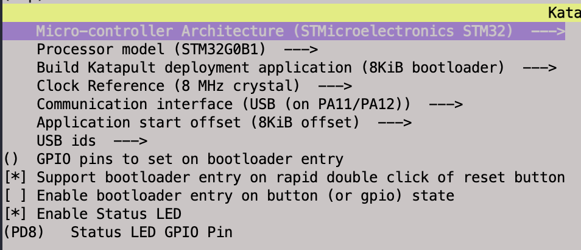
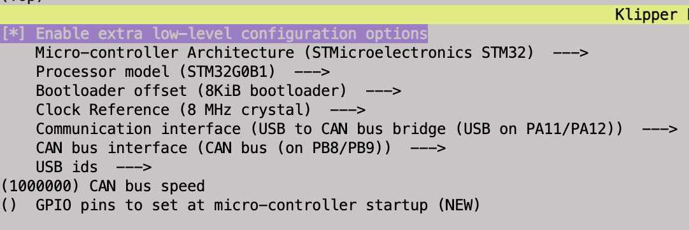

# Pheonix 3d Printer
## Install Base Pi Image
Raspberry Pi imager

Use Raspberry PiOS Lite (64 bit)
* Pre-configure SSH and WiFi

SSH in using 
```
pi@pheonix.home.sclow.com

vi /etc/ssh/sshd_config
```
Change
```
PasswordAuthentication = no
```
to 
```
PasswordAuthentication = yes
```

Re-configured WiFi
```
sudo raspi-config
...
```

Upgrade everything
```
sudo apt update
sudo apt upgrade
```


## Install Klipper
```
sudo apt-get update && sudo apt-get install git -y
cd ~ && git clone https://github.com/dw-0/kiauh.git
./kiauh/kiauh.sh
```

* Opt into KIAUH 6
* Install:
    + Klipper
        - Install one instance
        - Create sample printer.cfg
    + Moonraker
        - Create example moonraker.cfg
    + Mainsail
        - Download default Mainsail config
        - Bind to port 80
    + Crowsnest (webcam streamer)
        - Add update manger entry to moonraker.conf
        - Reboot (n)


Install optional / recommended packages:
```
sudo apt install dfu-programmer avrdude-doc gcc-doc apache2 lighttpd gpm ncurses-doc libnewlib-doc
```

## Custom GPIO commands (Power management)
Edit "moonraker.conf" in the Machine settings.

Include the following:
```
[power Printer]
type: gpio
pin: gpio17
locked_while_printing: True
on_when_job_queued: True
restart_klipper_when_powered: True
restart_delay: 2
bound_service: klipper

```

Add the following to mainsail.cfg
```
[gcode_macro _power_off_printer]
gcode:
    {action_call_remote_method(
        "set_device_power", device="Printer", state="off"
    )}
```

### Sonar (Maintain WiFi connection)

```
cd ~
git clone https://github.com/mainsail-crew/sonar.git
cd ~/sonar
make config
sudo make install
```

Accept the config changes but do not reboot.

Using the Machine settings, modify sonar.conf set:

```
[sonar]
enable: true               # false to disable till next reboot (will stop again if not set to true)
debug_log: false            # if set to true, sonar will log every ping with triptime and date/time
persistent_log: false       # If true logs in /var/log/sonar.log, false logs to systemd
target: auto                # IP Address, URL or auto as ping target
count: 3                    # How often should be pinged?
interval: 60                # Ping again after X seconds
restart_threshold: 10       # If failed, restart WiFi after X seconds

```


## Finalise install of Crowsnest
```
cd ~/crowsnest
sudo make install
```

Unclear why not installed properly by KIUAH

## Apply ZeroG theme to mainsail
```
cd ~/
git clone https://github.com/ZeroGDesign/zerog-mainsail-theme.git
bash ~/zerog-mainsail-theme/install.sh
```

Add the following to Moonraker.conf under the "[update_manager]" section

```
[update_manager client ZeroGTheme]
type: git_repo
path: ~/zerog-mainsail-theme
origin: https://github.com/ZeroGDesign/zerog-mainsail-theme.git
install_script: install.sh
is_system_service: False
```
### Install KAMP
```
 cd ~
 
 git clone https://github.com/kyleisah/Klipper-Adaptive-Meshing-Purging.git
 
 ln -s ~/Klipper-Adaptive-Meshing-Purging/Configuration printer_data/config/KAMP

 cp ~/Klipper-Adaptive-Meshing-Purging/Configuration/KAMP_Settings.cfg ~/printer_data/config/KAMP_Settings.cfg
```

Add the following to moonraker.conf
```
[update_manager Klipper-Adaptive-Meshing-Purging]
type: git_repo
channel: dev
path: ~/Klipper-Adaptive-Meshing-Purging
origin: https://github.com/kyleisah/Klipper-Adaptive-Meshing-Purging.git
managed_services: klipper
primary_branch: main


[file_manager]
enable_object_processing: True
```

In KAMP_settings.cfg enable Line purging

in printer.cfg add
```
[include KAMP_Settings.cfg]
[exclude_object]
```

### Allow direct upload from Cura
In moonraker.config add

```
# enables partial support of Octoprint API
[octoprint_compat]
```
Notes:
https://www.reddit.com/r/voroncorexy/comments/nv30eb/til_its_possible_to_upload_straight_to_mainsail/
https://github.com/Arksine/moonraker/blob/master/docs/configuration.md#octoprint_compat


## Reboot to activate new components
```sudo reboot```


## CANBus
### Configure Pi
#### Install packages

```
sudo apt install python3 python3-pip python3-can
```

#### Enable Networkd under SystemD
```
sudo systemctl enable systemd-networkd
```
#### Define CAN network
```
sudo nano /etc/systemd/network/can0.network

```

The contents should be as follows:
```
[Match]
Name=can*

[CAN]
BitRate=1000000
RestartSec=100ms
```

Then tune the link:

```
sudo nano /etc/systemd/network/can0.link

```

The contents should be as follows:
```
[Match]
OriginalName=can*

[Link]
ActivationPolicy=up
TransmitQueueLength=1024
RequiredForOnline=no
```


#### Start CANBus
```
sudo systemctl start systemd-networkd
```
Note: Can interface will not come up until we have our USB->Can bridge in place (custom klipper)

### Configure Katapult

```
cd ~
git clone https://github.com/Arksine/katapult
cd ~/katapult
make menuconfig
```

Settings as in 


### Configure Klipper

```
cd ~/klipper
make menuconfig
```

Settings as in 

```
make clean
make
```

Flash via Katapult
```
~/klippy-env/bin/python  ~/katapult/scripts/flashtool.py  -d /dev/serial/by-id/usb-katapult_stm32g0b1xx_1F003E001050415833323520-if00
```

#### Configure MCU
Edit [mcu] in printer.cfg to reflect use of CANBus
 
```
[mcu]
- serial: /dev/serial/by-id/usb-Klipper_Klipper_firmware_12345-if00
+ canbus_uuid: 2643d4211fe4
```

Notes: https://e3nglog.themakermedic.com/software_install-CANBUS.html

# Klipper Calibration
https://minimal3dp.com/klipper-calibration

## Updating Software over CANBus
### Update Katapult

Ensure latest Katapult:

```
test -e ~/katapult && (cd ~/katapult && git pull) || (cd ~ && git clone https://github.com/Arksine/katapult) ; cd ~
```

### Update Klipper

Pull and build latest Klipper:
```
test -e ~/klipper
cd ~/klipper
git pull
make clean
make menuconfig
make
```

### Prepare to receive image
Stop Klipper

```sudo service klipper stop```

Pull MCU uuid from printer.cfg
``` awk -v RS="" '/^\[mcu/','/\[/' ~/printer_data/config/printer.cfg  | grep canbus_uuid ```

Reboot the board into Katapult
```python3 ~/katapult/scripts/flashtool.py -i can0 -r -u yourmainboarduuid ```

You can verify it is in the proper mode by running ls /dev/serial/by-id/*. If you see a “usb-katapult-……” device then it is good to go.

```ls /dev/serial/by-id/*```

Use Katapult to flash the latest Klipper file to the board:

```python3 ~/katapult/scripts/flashtool.py -f ~/klipper/out/klipper.bin -d /dev/serial/by-id/usb-katapult_yourmainboardusbid```

python3 ~/katapult/scripts/flashtool.py -f ~/klipper/out/klipper.bin -d /dev/serial/by-id/usb-katapult_stm32g0b1xx_1F003E001050415833323520-if00

Check that the CAN adapter is now visible:
```lsusb```

Restart Klipper
```sudo service klipper start```

### Troubleshooting

https://canbus.esoterical.online

